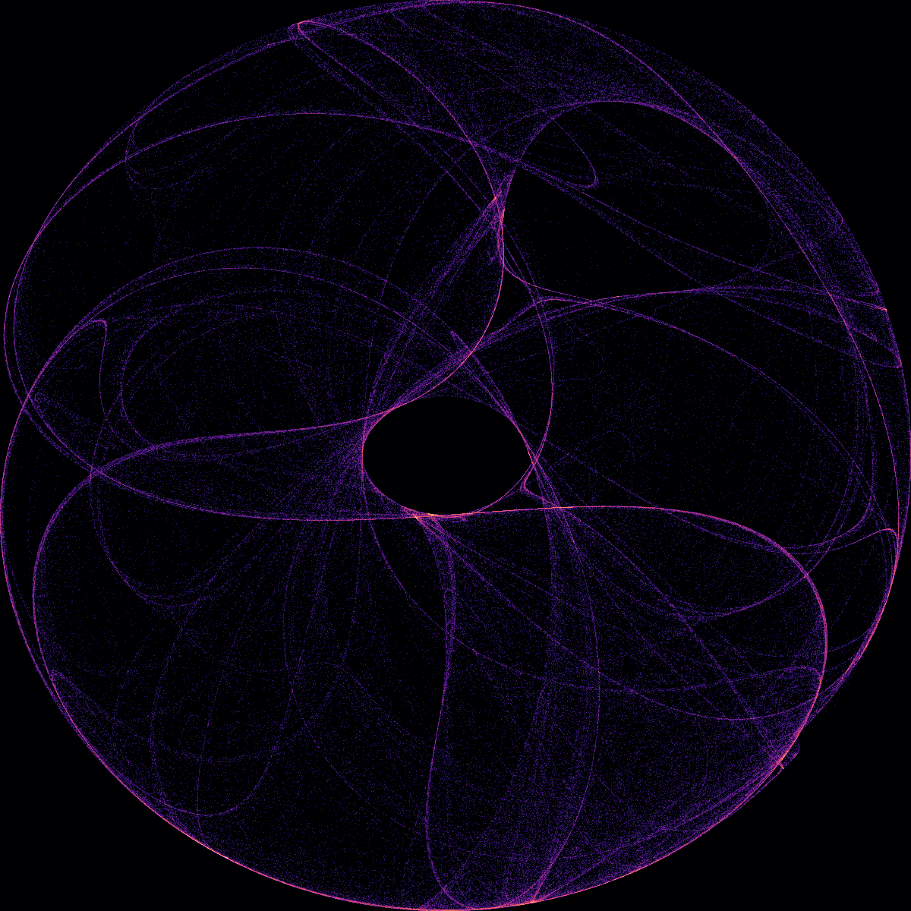

# Chaos Art Generator

Create mesmerizing generative art using **chaotic strange attractors**.  A strange attractor is a set of points in a dynamical system that appears chaotic yet exhibits structure.  By iteratively applying simple non‑linear equations, we can generate beautiful patterns from seemingly random numbers.

This project explores one such system – the *Clifford attractor* – and renders its trajectories as high‑resolution images using Python.  Each image you generate is unique: it depends on a random set of parameters and a randomly chosen colour palette.

## What it does

When you run the script, it will:

1. Pick random parameters \(\*a\*, \*b\*, \*c\*, \*d\*) for the Clifford attractor from the range \[-3 … 3\].  These constants determine how the attractor behaves.
2. Iteratively compute a large number of points \((x_n, y_n)\) using the recurrence:

   \[
      \begin{aligned}
      x_{n+1} &= \sin(a\,y_n) + c\,\cos(a\,x_n),\\
      y_{n+1} &= \sin(b\,x_n) + d\,\cos(b\,y_n).
      \end{aligned}
   \]

3. Accumulate the density of those points into a two‑dimensional histogram.  The histogram is log‑scaled so that both dense and sparse regions of the attractor become visible.
4. Apply a random colour map to turn the histogram into art and save the result as a PNG file.

Because the parameters are random, each run produces a completely new image.  Some parameter sets yield delicate wisps, others create dense knots or striking symmetries.  Feel free to experiment with the random seeds or ranges to discover new motifs.

## Quick start

This project depends only on NumPy and Matplotlib, which are already available in most Python environments.

```
python3 generate_art.py \
    --count 3 \
    --iterations 800000 \
    --resolution 3000 3000 \
    --output_dir images
```

**Arguments:**

| Argument       | Description                                              | Default   |
|---------------:|----------------------------------------------------------|-----------|
| `--count`      | How many images to generate                             | `1`       |
| `--iterations` | Number of points to iterate per image                   | `600000`  |
| `--resolution` | Width and height (pixels) of the generated histogram    | `2000 2000` |
| `--output_dir` | Folder where images will be saved                       | `images`  |
| `--seed`       | Optional integer seed for reproducibility               | *random*  |

After running the script, you will find your artwork in the `images` directory.  The program prints the chosen parameters for each image, so you can reproduce a favourite by specifying `--params` in a future run (see `python3 generate_art.py --help`).

## How it works

The Clifford attractor is one of many so‑called *iterated function systems*.  Even though the update rules involve only sine and cosine, the repeated interplay of non‑linear terms produces intricate structures.  For a deeper exploration of chaos and strange attractors, consider reading *Nonlinear Dynamics and Chaos* by Steven H. Strogatz or experimenting with other attractors (Lorenz, Rössler, Peter de Jong, etc.).

## Example

Below is an example generated by this script.  Run it yourself to see what surprises emerge!


